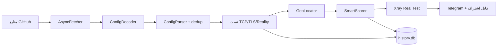

# V2Ray Smart Collector

<div align="center">

**جمع‌آوری خودکار، تست چندمرحله‌ای و انتشار کانفیگ‌های V2Ray** — اجرا در GitHub Actions یا Termux

[](https://github.com/alireza786786/alireza786786/actions/workflows/run.yml)


</div>

## ✨ ویژگی‌ها

- **۶ پروتکل** — vless / trojan / hysteria2 / shadowsocks / vmess (فعال)
- **پورت‌های طلایی دو ردیفه** — اولویت ۱: 443، 2053، 2083، 2087، 2096، 8443 · اولویت ۲: 80، 2052، 2082، 2086، 8080، 8880 — با بونس امتیازی و سوییچ فیلتر اختیاری
- **dedup هوشمند** — در host:port تکراری، با‌ارزش‌ترین پروتکل می‌ماند (Reality > vless > trojan > hy2 > vmess > ss)
- **پارس سخت‌گیرانه** — اعتبارسنجی host و پورت، پشتیبانی SIP002 و IPv6
- **تست چندمرحله‌ای** — TCP / TLS / Reality + **تست واقعی با Xray-core**
- **امتیازدهی هوشمند** — پینگ، پایداری، پروتکل، کشور، پورت طلایی و اعتبار تاریخی (SQLite + WAL)
- **GeoIP موازی** با کش پایدار
- **rename تضمینی نام کانال** — همه پروتکل‌ها حتی vmess (JSON «ps»)
- **انتشار خودکار** — تلگرام + فایل‌های اشتراک در ریپو

## 🚀 شروع سریع

```bash
pip install -r requirements.txt
export BOT_TOKEN=... CHAT_ID=...   # اختیاری — بدون آن فقط فایل ساخته می‌شود
python v2ray_collector_v3.py
```

## ⚙️ فرایند



## 🕐 اجرای خودکار

ویجت اجرای GitHub Actions هر ۶ ساعت اسکریپت را می‌راند؛ خروجی به‌صورت خودکار در ریپو کامیت می‌شود. تنظیم اسکریپت در `.github/workflows/run.yml` است.

## 🧱 ساختار

```
v2ray_collector_v3.py          اسکریپت اصلی
test_v2ray.py                  ۲۶ تست واحد pytest
requirements.txt               وابستگی‌ها
.github/workflows/run.yml      اجرای خودکار
```

## 📌 یادداشت‌ها

- hysteria2 فقط با TCP-ping فیلتر می‌شود (اعتبارسنجی کامل نیاز به پروب QUIC دارد)
- vmess به‌طور پیش‌فرض خاموش است — با `INCLUDE_VMESS=True` فعال شود
- برای تست‌ها: `pytest test_v2ray.py -v`
